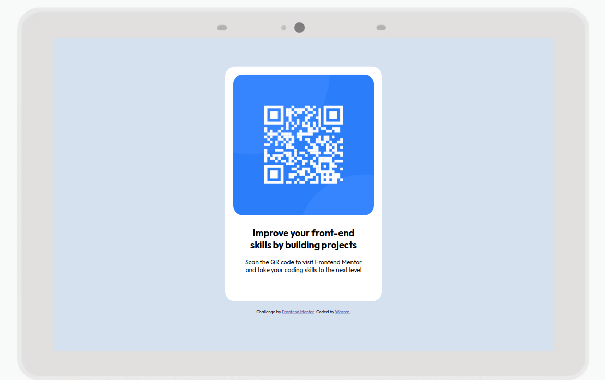

# Frontend Mentor - QR code component solution

This is a solution to the [QR code component challenge on Frontend Mentor](https://www.frontendmentor.io/challenges/qr-code-component-iux_sIO_H). Frontend Mentor challenges help you improve your coding skills by building realistic projects. 

## Table of contents

- [Overview](#overview)
  - [Screenshot](#screenshot)
  - [Links](#links)
- [My process](#my-process)
  - [Built with](#built-with)
  - [Continued development](#continued-development)
  - [Useful resources](#useful-resources)
- [Author](#author)
- [Acknowledgments](#acknowledgments)

**Note: Delete this note and update the table of contents based on what sections you keep.**

## Overview

### Screenshot

Add a screenshot of your solution. The easiest way to do this is to use Firefox to view your project, right-click the page and select "Take a Screenshot". You can choose either a full-height screenshot or a cropped one based on how long the page is. If it's very long, it might be best to crop it.

Alternatively, you can use a tool like [FireShot](https://getfireshot.com/) to take the screenshot. FireShot has a free option, so you don't need to purchase it. 

Then crop/optimize/edit your image however you like, add it to your project, and update the file path in the image above.

### Links

- Solution URL: [https://www.frontendmentor.io/solutions/qr-code-component-9Cw7S9PyhE](https://www.frontendmentor.io/solutions/qr-code-component-9Cw7S9PyhE)
- Live Site URL: [https://warrenflewellen.github.io/qrcode/](https://warrenflewellen.github.io/qrcode/)

## My process

### Built with

- HTML5 markup
- CSS custom properties
- Flexbox
- CSS Grid
- Mobile-first workflow

### Continued development

I would like to add some functionality with JavaScript in the future, as well as using a framework to help build future projects.

### Useful resources

- [Stackoverflow](https://www.stackoverflow.com) - This resource definitely helped me out a lot with figuring out flexbox. This website is an industry standard when it comes to help within the dev community.

## Author

- Website - [Warren](https://www.warrenflewellen.com)
- Frontend Mentor - [@warrenflewellen](https://www.frontendmentor.io/profile/warrenflewellen)

## Acknowledgments

I'd like to thank Frontend Mentor for helping me throughout my journey as a Frontend Developer. This resource is truly a treasure. 
